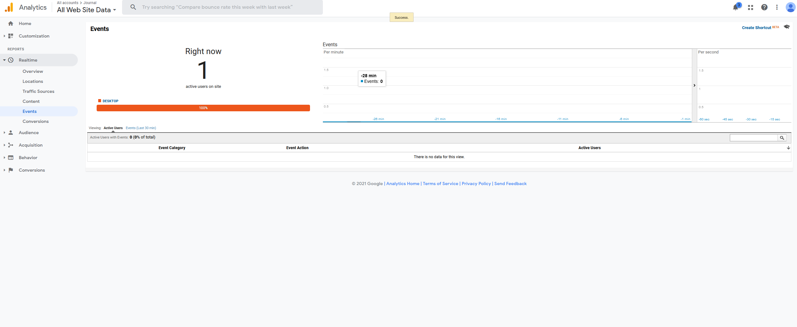

# Lab 10
## Authors
- Kevin Dyblie
- Ethan Lew

## Link to Roadmap & Feature Requests page

https://cse110-lab10-kdyblie.canny.io/

## Links to two A / B test pages from Part 2

https://kdyblie.github.io/Lab10/index.html

https://kdyblie.github.io/Lab10/secondSplit.html

## Explanation of your custom A / B for the secondSplit.html page

This split compares light mode and dark mode. For light mode, we left everything the same. For dark mode, we changed the colors of the backgrounds. The difference should be the colors when testing it.

## Screenshots from Part 3

For some reason, while we could get the views/active user working, the events would not appear. This is even after going to office hours where they were unable to help us fix the problem.
